# Digi2 Platform

<p align="center">


</p>

---

# Digi2 Platform

A **production-ready cloud platform** built with modern DevOps practices, secure infrastructure, automated deployments, comprehensive observability, and operational excellence.

The platform demonstrates how to design, deploy, monitor, secure, and operate a real-world multi-service web application using Docker Compose on AWS.

---

# Project Highlights

* Production deployment on AWS EC2
* HTTPS with Nginx and Let's Encrypt
* Django REST Framework backend
* Next.js frontend
* PostgreSQL database
* Docker Compose production deployment
* GitHub Actions CI/CD
* Amazon ECR image registry
* Blue/Green deployment strategy
* Automated rollback scripts
* Prometheus monitoring
* Grafana dashboards
* Loki centralized logging
* Promtail log collection
* Tempo distributed tracing
* OpenTelemetry instrumentation
* Runtime security using Falco
* Automated PostgreSQL backups
* Automated media backups
* S3 off-site backup synchronization
* Production runbooks
* Infrastructure hardening

---

# Production Architecture

```
                        GitHub
                           │
                           ▼
                  GitHub Actions CI/CD
                           │
                           ▼
                    Amazon ECR Registry
                           │
                           ▼
                 AWS EC2 Production Server
                           │
        ┌──────────────────┴──────────────────┐
        │                                     │
        ▼                                     ▼
    Nginx HTTPS                        Monitoring Stack
        │                                     │
        ├───────────────┐                     │
        ▼               ▼                     │
   Django Backend   Next.js Frontend          │
        │                                     │
        ▼                                     ▼
     PostgreSQL        Prometheus • Grafana • Loki
                                Tempo • OTel
                                   Falco
```

---

# Technology Stack

## Cloud

* AWS EC2
* Amazon ECR
* IAM
* Security Groups
* Route53
* S3
* Let's Encrypt

## Backend

* Django
* Django REST Framework
* Gunicorn

## Frontend

* Next.js
* React

## Database

* PostgreSQL 16

## Reverse Proxy

* Nginx

## Containers

* Docker
* Docker Compose

## CI/CD

* GitHub Actions
* Blue/Green Deployment
* Rollback Automation

## Observability

* Prometheus
* Grafana
* Loki
* Promtail
* Tempo
* OpenTelemetry Collector

## Runtime Security

* Falco
* Seccomp
* Read-only Containers
* Linux Capability Dropping
* No-New-Privileges

---

# Repository Structure

```
DIGI2-PLATFORM
│
├── apps/
│   ├── backend/
│   └── frontend/
│
├── infra/
│   ├── nginx/
│   ├── security/
│   ├── terraform/
│   └── scripts/
│
├── monitoring/
│   ├── prometheus/
│   ├── grafana/
│   ├── loki/
│   ├── promtail/
│   ├── tempo/
│   ├── otel/
│   ├── falco/
│   └── blackbox/
│
├── docs/
│   └── runbooks/
│
├── certbot/
├── scripts/
├── backups/
└── .github/
```

---

# Production Features

## Infrastructure

* Production Docker deployment
* Reverse proxy
* Automatic HTTPS
* Health checks
* Restart policies

## Security

* Non-root containers
* Read-only filesystem
* Seccomp profiles
* Linux capability dropping
* Runtime intrusion detection
* Security headers
* TLS encryption

## Reliability

* Blue/Green deployment
* Automated rollback
* Daily backups
* Off-site backup synchronization
* Disaster recovery procedures

## Observability

* Metrics
* Logs
* Traces
* Runtime security events
* Alerting
* Dashboard provisioning as code

---

# CI/CD Pipeline

The Digi2 Platform uses a fully automated CI/CD workflow powered by **GitHub Actions** and **Amazon ECR**.

## Deployment Flow

```text
Developer
    │
    ▼
Git Push
    │
    ▼
GitHub Actions
    │
    ├── Build Backend Image
    ├── Build Frontend Image
    ├── Security Checks
    ├── Push Images to Amazon ECR
    ▼
Production Server
    │
    ▼
Blue/Green Deployment
    │
    ▼
Health Verification
    │
    ▼
Production Traffic
```

### CI/CD Features

* Automated Docker image builds
* Amazon ECR image publishing
* Versioned container images
* Blue/Green deployments
* Health verification
* Rollback support
* Deployment history logging

---

# Security Architecture

Security was incorporated throughout the platform using multiple defensive layers.

## Infrastructure Security

* HTTPS enforced with Let's Encrypt
* Nginx reverse proxy
* Security headers
* Secure cookies
* Private Docker networking
* PostgreSQL isolated from the public Internet

---

## Container Security

Each application container is configured with:

* Non-root user
* Read-only filesystem
* tmpfs writable directory
* No privilege escalation
* Linux capability dropping
* Custom seccomp profile
* Memory limits
* Restart policies

---

## Runtime Security

Falco continuously monitors runtime behavior and detects:

* Shell execution inside containers
* Sensitive file access
* Privilege escalation
* Suspicious process execution
* Container security violations

---

# Monitoring & Observability

The Digi2 Platform implements the **Three Pillars of Observability**.

## Monitoring & Observability

### Digi2 Production Overview
- Infrastructure health
- Website uptime
- SSL certificate status
- PostgreSQL health
- Response time
- Resource utilization
- Runtime security metrics
- Log ingestion status

### PostgreSQL Dashboard
- Database performance
- Connections
- Transactions
- Query metrics

### Node Exporter Dashboard
- CPU
- Memory
- Disk
- Network
- Filesystem

## Metrics

Powered by **Prometheus**

Collected metrics include:

* CPU usage
* Memory usage
* Disk usage
* Container health
* Application availability
* PostgreSQL metrics
* Docker metrics
* SSL certificate status

---

## Dashboards

Powered by **Grafana**

Dashboards include:

* Infrastructure Overview
* Container Monitoring
* PostgreSQL Database
* SSL Monitoring
* Runtime Security
* Active Alerts

Dashboards are automatically provisioned as code using Grafana provisioning.

---

## Logging

Powered by **Loki + Promtail**

Centralized logs include:

* Backend logs
* Frontend logs
* Nginx logs
* PostgreSQL logs
* Docker container logs
* Falco runtime events

---

## Distributed Tracing

Powered by **Tempo + OpenTelemetry**

Application requests are traced end-to-end across:

* Frontend
* Backend
* Database interactions

This improves troubleshooting and performance analysis.

---

# Alerting

Prometheus Alertmanager automatically generates alerts for:

* Backend unavailable
* Frontend unavailable
* PostgreSQL unavailable
* Website unavailable
* SSL certificate expiration
* High CPU usage
* High memory usage
* High disk usage
* Runtime security events

---

# Backup & Disaster Recovery

## Automated Database Backups

Daily PostgreSQL backups:

* Timestamped
* Compressed
* Restore-ready
* Integrity verified

---

## Media Backups

Automated media archive creation:

* Compressed archives
* Daily snapshots
* Restore verification

---

## Off-Site Backup

Backups are synchronized to Amazon S3.

Features include:

* Automated uploads
* Lifecycle management
* Retention policies
* Off-site disaster recovery

---

# Operational Excellence

The platform includes operational practices commonly found in production environments.

## Health Validation

* Docker health checks
* Container restart policies
* Service readiness verification
* Internal networking validation

---

## Logging

Docker daemon log rotation:

* JSON log driver
* 10 MB log size
* Three rotated log files
* Prevents uncontrolled disk growth

---

## Disaster Recovery

Validated procedures include:

* Backup verification
* Restore verification
* Database recovery readiness
* Media recovery readiness
* Operational recovery documentation

---

# Production Runbooks

Operational documentation is maintained under:

```text
docs/runbooks/
```

Available runbooks:

* Deployment Runbook
* Rollback Runbook
* Incident Response Runbook
* Disaster Recovery Runbook

These documents define standardized operational procedures for maintaining and recovering the platform.

---

# Production Readiness Checklist

| Area                      | Status |
| ------------------------- | :----: |
| HTTPS                     |    ✅   |
| Docker Compose            |    ✅   |
| PostgreSQL                |    ✅   |
| Nginx                     |    ✅   |
| CI/CD                     |    ✅   |
| Blue/Green Deployment     |    ✅   |
| Rollback                  |    ✅   |
| Runtime Security          |    ✅   |
| Prometheus                |    ✅   |
| Grafana                   |    ✅   |
| Loki                      |    ✅   |
| Tempo                     |    ✅   |
| OpenTelemetry             |    ✅   |
| Alertmanager              |    ✅   |
| Backup Verification       |    ✅   |
| Disaster Recovery         |    ✅   |
| Production Runbooks       |    ✅   |
| Operational Documentation |    ✅   |
| Health Checks             |    ✅   |
| Log Rotation              |    ✅   |
| Security Hardening        |    ✅   |

---

## Screenshots

### Architecture

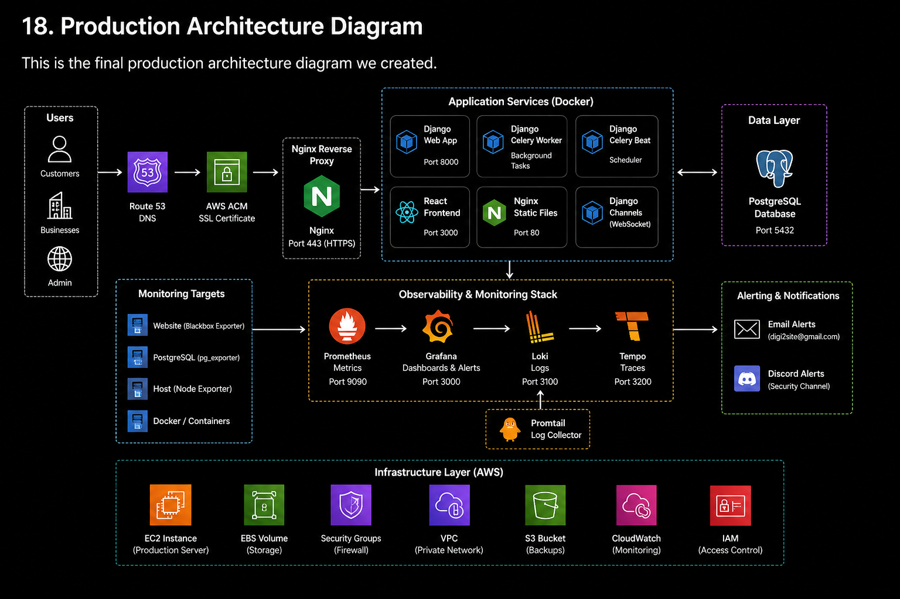

### Monitoring & Observability

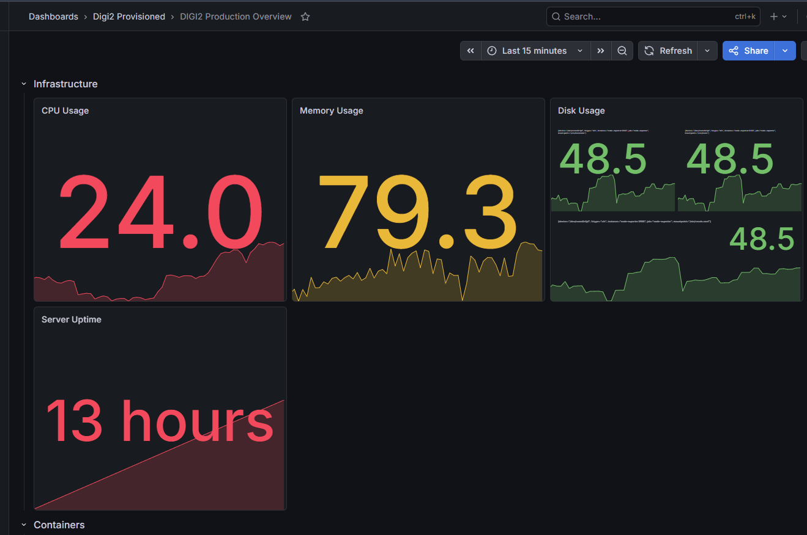

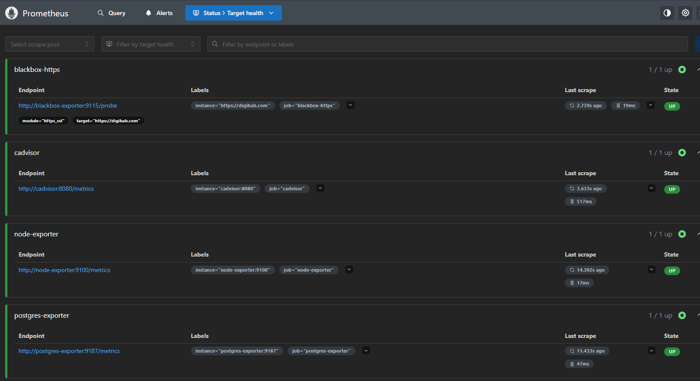

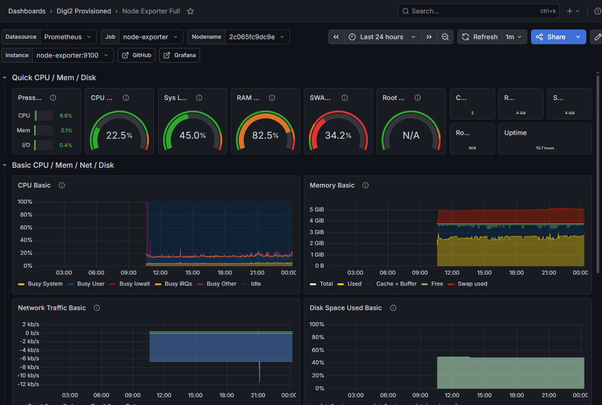

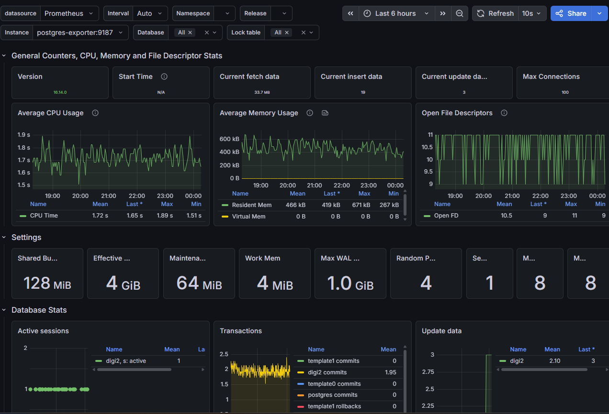

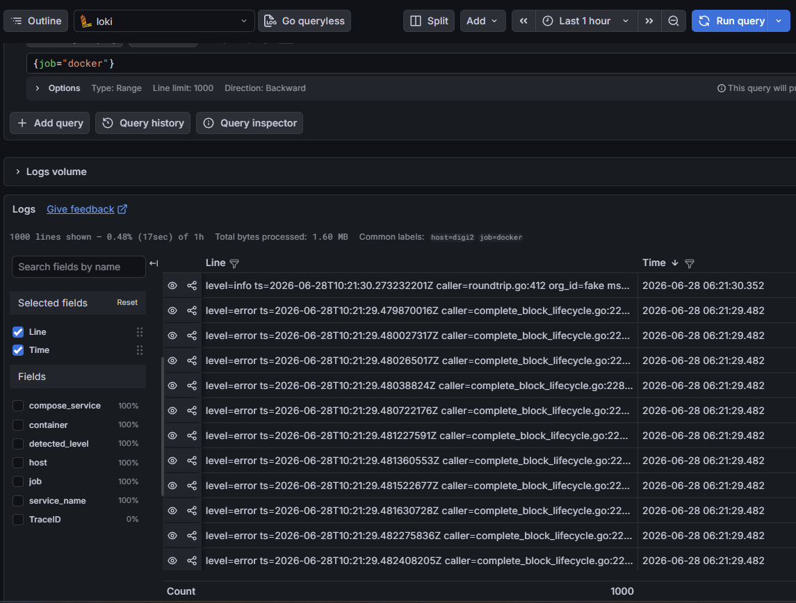

### Alerting

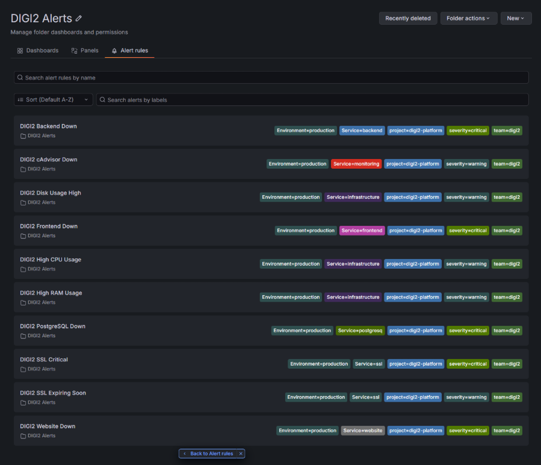

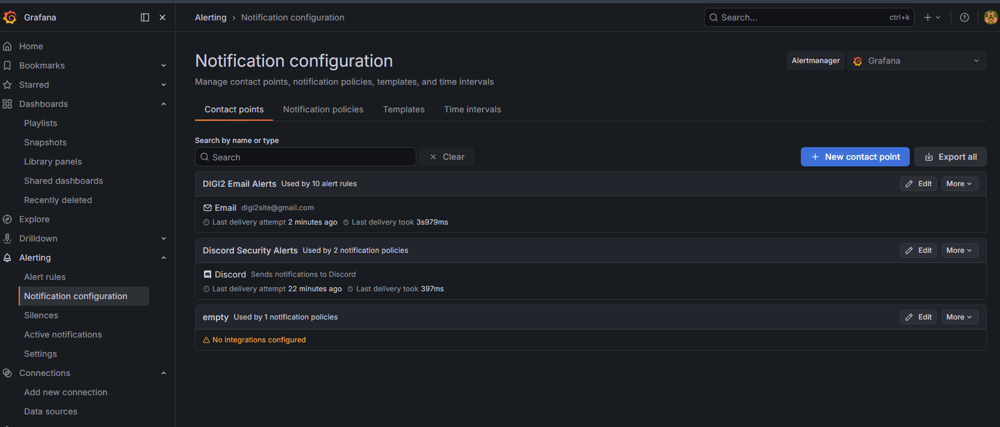

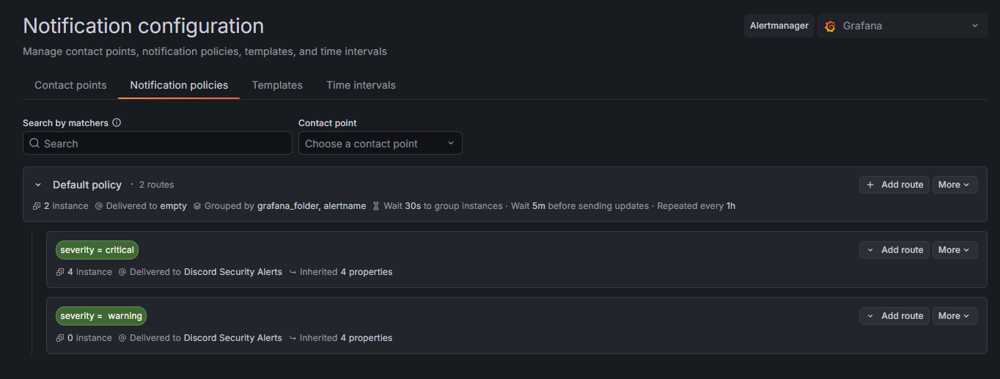

### Infrastructure

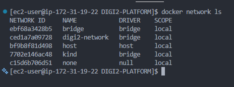

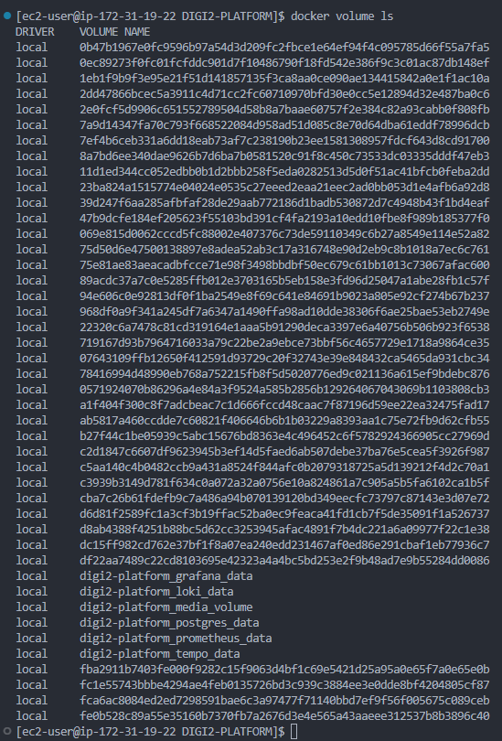

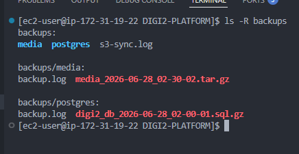

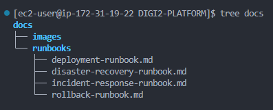

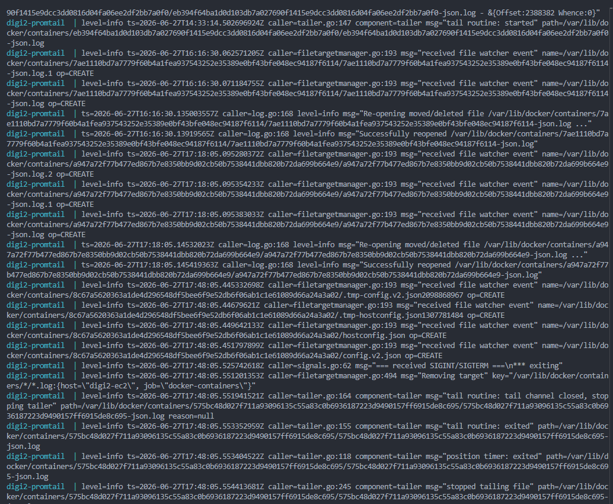


---

# Skills Demonstrated

## Cloud

* AWS EC2
* Amazon ECR
* Amazon S3
* IAM
* Route53
* Linux

---

## DevOps

* Docker
* Docker Compose
* GitHub Actions
* CI/CD
* Blue/Green Deployment
* Rollback Automation
* Production Operations

---

## Platform Engineering

* Infrastructure Design
* Reverse Proxy Architecture
* Secure Networking
* Container Hardening
* Runtime Security

---

## Observability

* Prometheus
* Grafana
* Loki
* Promtail
* Tempo
* OpenTelemetry
* Alertmanager

---

## Security

* HTTPS
* Security Headers
* Seccomp
* Least Privilege
* Read-only Containers
* Falco Runtime Security

---

## Reliability Engineering

* Health Checks
* Restart Policies
* Monitoring
* Alerting
* Automated Backups
* Disaster Recovery
* Operational Runbooks

---

# What This Project Demonstrates

This repository demonstrates the ability to:

* Design production infrastructure.
* Deploy secure cloud-native applications.
* Build automated CI/CD pipelines.
* Implement comprehensive observability.
* Secure containers using defense-in-depth.
* Operate production services.
* Build disaster recovery processes.
* Create operational documentation.
* Apply Site Reliability Engineering (SRE) principles.

---

# Future Enhancements

Planned improvements include:

* Kubernetes (Amazon EKS) deployment
* Helm chart packaging
* ArgoCD GitOps
* Horizontal auto-scaling
* Service mesh (Istio)
* Secrets management with AWS Secrets Manager
* Multi-AZ deployment
* High availability PostgreSQL
* Distributed caching with Redis
* Canary deployments

---

# Talking Points

This project can be used to discuss:

* Docker Compose production architecture
* Reverse proxy design
* Blue/Green deployment strategy
* Runtime container security
* Monitoring and observability
* Incident response
* Disaster recovery
* Backup verification
* Production operations
* CI/CD automation
* AWS infrastructure
* Platform engineering practices

---

# Repository Statistics

## Components

* Django Backend
* Next.js Frontend
* PostgreSQL
* Nginx
* Prometheus
* Grafana
* Loki
* Promtail
* Tempo
* OpenTelemetry Collector
* Falco
* Alertmanager
* Blackbox Exporter
* Node Exporter
* PostgreSQL Exporter

---

## Documentation

* Deployment Runbook
* Rollback Runbook
* Incident Response Runbook
* Disaster Recovery Runbook

---

# Author

**Babatunde Ayo**

DevOps • Cloud • Platform Engineer

* GitHub: https://github.com/digimind34
* LinkedIn: [Babatunde](https://www.linkedin.com/in/babatunde-ayo-devops/)
* Email: [olaayoire@gmail.com](mailto:olaayoire@gmail.com)

---

# License

This project is provided for educational and portfolio purposes.

---

# Acknowledgements

This project incorporates industry best practices inspired by:

* Docker
* AWS Well-Architected Framework
* Prometheus
* Grafana Labs
* OpenTelemetry
* Falco
* PostgreSQL
* Nginx
* Django
* Next.js

---

<p align="center">

**Production-ready. Secure. Observable. Recoverable. Documented.**

**Built with modern DevOps and Platform Engineering practices.**

</p>
